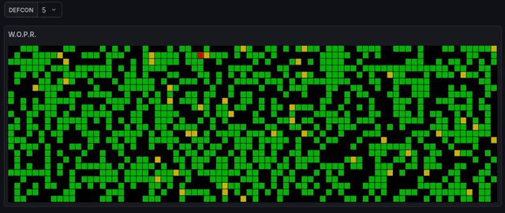

# WOPR Panel — Grafana Plugin


<br>


A homage to the [WOPR](https://en.wikipedia.org/wiki/WarGames#The_WOPR) (War Operation Plan Response) computer from the 1983 film [WarGames](https://en.wikipedia.org/wiki/WarGames).

In the film, WOPR is a military supercomputer tasked with continuously running simulations of thermonuclear war in order to predict outcomes and refine strategy. It never stops. It never sleeps. It is always asking: *"Shall we play a game?"*

This panel renders an 80×24 grid of LEDs — one per simulation — each reporting the outcome of the latest run. The current [DEFCON](https://en.wikipedia.org/wiki/DEFCON) level controls the probability distribution of outcomes across the grid.

## What each colour means

| Colour | Meaning |
|--------|---------|
| **Green** | Simulation completed — outcome within modelled norms |
| **Yellow** | Simulation completed — significant casualties, conventional or limited exchange |
| **Red** | Simulation completed — nuclear weapons used, mass casualties |
| **Black** | Simulation did not finish — program ran out of time, resources, or hope |

## Options

| Option | Description |
|--------|-------------|
| **DEFCON** | Threat level 5 (peacetime) → 1 (maximum). Controls the probability mix of outcomes. Accepts a dashboard variable e.g. `$defcon`. |
| **Tick interval (ms)** | How often the grid updates. Default 100ms. |

## DEFCON outcome probabilities

| Level | Green | Black | Yellow | Red |
|-------|-------|-------|--------|-----|
| 5     | 45%   | 50%   | 4%     | 1%  |
| 4     | 44%   | 40%   | 13%    | 3%  |
| 3     | 39%   | 30%   | 23%    | 8%  |
| 2     | 25%   | 40%   | 21%    | 14% |
| 1     | 2%    | 77%   | 10%    | 11% |

> At DEFCON 1, most simulations don't finish. A handful still come out green —
> because even at the edge of annihilation, some futures survive.

---

## Development

### Getting started

1. Install dependencies

   ```bash
   npm install
   ```

2. Build plugin in development mode and run in watch mode

   ```bash
   npm run dev
   ```

3. Build plugin in production mode

   ```bash
   npm run build
   ```

4. Run the tests (using Jest)

   ```bash
   npm run test        # watch mode (requires git init)
   npm run test:ci     # single run
   ```

5. Spin up a Grafana instance with the plugin pre-loaded (using Docker)

   ```bash
   docker compose up --build
   # Grafana opens at http://localhost:3000 with the WOPR dashboard as home
   ```

6. Run the E2E tests (using Playwright)

   ```bash
   npm run server
   npm run e2e
   ```

7. Run the linter

   ```bash
   npm run lint
   npm run lint:fix
   ```

---

## Distributing / publishing

When distributing a Grafana plugin the plugin must be signed so Grafana can verify its authenticity.

_Note: Signing is not required during development — the Docker dev environment runs unsigned plugins automatically._

Before signing, read the Grafana [plugin publishing and signing criteria](https://grafana.com/legal/plugins/#plugin-publishing-and-signing-criteria) and [signature levels](https://grafana.com/legal/plugins/#what-are-the-different-classifications-of-plugins) documentation.

1. Create a [Grafana Cloud account](https://grafana.com/signup).
2. Ensure the first part of the plugin ID matches your Grafana Cloud account slug (`mampersat-`).
3. Create a Grafana Cloud API key with the `PluginPublisher` role.

### Signing via GitHub Actions

The release workflow (`.github/workflows/release.yml`) handles signing automatically. Add your API key as a repository secret:

1. Go to **Settings → Secrets → Actions** in the repo.
2. Click **New repository secret**.
3. Name: `GRAFANA_API_KEY` — paste your Grafana Cloud API key.

### Triggering a release

```bash
npm version <major|minor|patch>
git push origin main --follow-tags
```

---

## References

- [WarGames (1983)](https://en.wikipedia.org/wiki/WarGames) — Wikipedia
- [WOPR](https://en.wikipedia.org/wiki/WarGames#The_WOPR) — Wikipedia
- [DEFCON](https://en.wikipedia.org/wiki/DEFCON) — Wikipedia
- [`plugin.json` reference](https://grafana.com/developers/plugin-tools/reference/plugin-json)
- [Grafana panel plugin examples](https://github.com/grafana/grafana-plugin-examples/tree/master/examples/panel-basic#readme)
- [How to sign a plugin](https://grafana.com/developers/plugin-tools/publish-a-plugin/sign-a-plugin)
